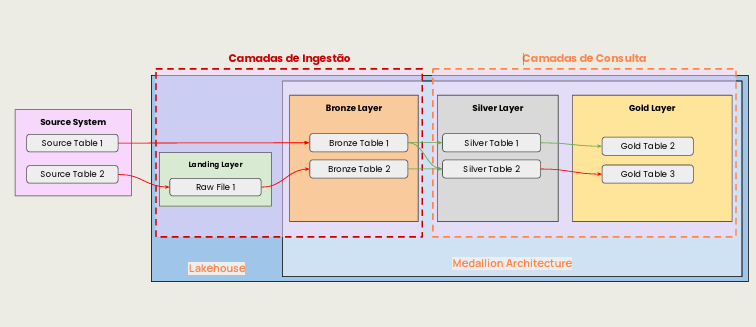

# Medallion Data Pipeline

Pipeline de Engenharia de Dados desenvolvido em **Python**, utilizando **Pandas** e **DuckDB**, com implementação da **Arquitetura Medalhão (Medallion Architecture)** para ingestão, transformação, enriquecimento e refinamento de dados.

<p align="center">
  
</p>

---

## 📌 Sobre o projeto

Este projeto demonstra a construção de um pipeline de dados utilizando o conceito de **Arquitetura Medalhão**, organizando o processamento em diferentes camadas de dados.

O fluxo parte de arquivos CSV disponibilizados na camada **Landing**, passa pelas etapas de ingestão e tratamento e termina na camada **Gold**, onde os dados são estruturados para utilização analítica.

O projeto foi desenvolvido com foco em conceitos fundamentais de **Engenharia de Dados**, como:

* Ingestão de dados
* ETL
* Processamento e transformação de dados
* SQL
* Deduplicação
* Modelagem de dados
* Arquitetura Medalhão
* Processamento incremental
* Organização de pipelines
* Armazenamento e processamento com DuckDB

---

## 🏗️ Arquitetura

O pipeline segue o seguinte fluxo:

```text
                    ┌──────────────┐
                    │    Landing   │
                    │    CSVs      │
                    └──────┬───────┘
                           │
                           ▼
                    ┌──────────────┐
                    │    Bronze    │
                    │ Dados brutos │
                    └──────┬───────┘
                           │
                           ▼
                    ┌──────────────┐
                    │    Silver    │
                    │ Dados tratados│
                    └──────┬───────┘
                           │
                           ▼
                    ┌──────────────┐
                    │     Gold     │
                    │ Dados para   │
                    │    análise   │
                    └──────────────┘
```

### Fluxo implementado

```text
CSV
 │
 ▼
LANDING
 │
 ▼
BRONZE
bronze_z0019
 │
 ▼
SILVER
produtos
 │
 ▼
GOLD
dim_produtos
```

---

## 🔄 Fluxo de dados

### 🟤 Bronze — Ingestão

A primeira etapa do pipeline realiza a ingestão dos arquivos CSV presentes na camada Landing.

Durante a ingestão são adicionadas informações de controle:

* `nome_arquivo`
* `data_ingestao`

Os dados são armazenados no DuckDB na tabela:

```text
bronze_z0019
```

Essa camada mantém os dados próximos de sua estrutura original, adicionando apenas os metadados necessários para rastreabilidade e controle do processo.

---

### ⚪ Silver — Enriquecimento e tratamento

Na camada Silver são aplicadas transformações para preparar os dados para utilização pelas etapas seguintes.

Entre os tratamentos realizados estão:

* Seleção do registro mais recente por produto;
* Deduplicação utilizando `ROW_NUMBER()`;
* Remoção de metadados de ingestão;
* Padronização dos nomes das colunas;
* Conversão dos tipos de dados;
* Estruturação da tabela de produtos.

Os principais campos são padronizados para:

```text
id
nm_produto
id_categoria
id_fornecedor
vl_preco
```

O resultado é armazenado na tabela:

```text
produtos
```

---

### 🟡 Gold — Refinamento

A camada Gold representa a etapa final do pipeline.

Nesta etapa são selecionadas as informações necessárias para utilização analítica, resultando em uma estrutura dimensional simplificada.

A tabela criada é:

```text
dim_produtos
```

Com os campos:

```text
id_produto
nm_produto
vl_produto
```

Essa estrutura representa uma primeira camada preparada para consumo analítico e pode futuramente ser expandida para outras dimensões e tabelas de fatos.

---

## 🛠️ Tecnologias utilizadas

| Tecnologia           | Utilização                              |
| -------------------- | --------------------------------------- |
| **Python**           | Desenvolvimento do pipeline             |
| **Pandas**           | Manipulação e transformação dos dados   |
| **DuckDB**           | Armazenamento e processamento SQL       |
| **SQL**              | Consultas e transformações              |
| **Jupyter Notebook** | Desenvolvimento e execução das etapas   |
| **Git**              | Controle de versão                      |
| **GitHub**           | Versionamento e documentação do projeto |

---

## 📂 Estrutura do projeto

```text
medallion-data-pipeline/
│
├── docs/
│   └── Estrutura_do_Projeto_arquitetura_Medalhao.png
│
├── landing/
│   ├── z0019_1.csv
│   └── z0019_2.csv
│
├── scripts/
│   ├── ingestao.ipynb
│   ├── enriquecimento.ipynb
│   ├── refinamento.ipynb
│   └── .gitignore
│
└── README.md
```

---

## ▶️ Como executar

### 1. Clone o repositório

```bash
git clone https://github.com/lucasvieirafelisberto/medallion-data-pipeline.git
```

### 2. Acesse o projeto

```bash
cd medallion-data-pipeline
```

### 3. Instale as dependências

```bash
pip install pandas duckdb jupyter
```

### 4. Execute os notebooks

Os notebooks devem ser executados na seguinte ordem:

```text
1. ingestao.ipynb
2. enriquecimento.ipynb
3. refinamento.ipynb
```

Eles estão localizados em:

```text
scripts/
```

As etapas utilizam caminhos relativos ao diretório do projeto.

---

## 🧠 Conceitos de Engenharia de Dados aplicados

O projeto foi desenvolvido buscando aplicar conceitos utilizados em pipelines de dados reais:

### Arquitetura Medalhão

Separação dos dados em camadas com diferentes níveis de tratamento:

```text
Landing → Bronze → Silver → Gold
```

### Rastreabilidade

A camada Bronze registra informações sobre a origem e o momento da ingestão:

```text
nome_arquivo
data_ingestao
```

### Deduplicação

A camada Silver utiliza funções de janela SQL para identificar o registro mais recente de cada produto:

```sql
ROW_NUMBER() OVER (
    PARTITION BY NATBR
    ORDER BY data_ingestao DESC
)
```

### Padronização

Os nomes e tipos das colunas são tratados durante o processo de enriquecimento.

### Modelagem

A camada Gold apresenta uma estrutura dimensional inicial através da tabela:

```text
dim_produtos
```

---

## 🎯 Objetivo profissional

Este projeto faz parte do meu portfólio de **Engenharia de Dados**, com o objetivo de demonstrar conhecimentos práticos em construção e organização de pipelines de dados.

A implementação busca representar, de forma prática, conceitos fundamentais utilizados no desenvolvimento de soluções de dados, desde a ingestão até a disponibilização de dados estruturados para análise.

---

## 👨‍💻 Autor

**Lucas Vieira Felisberto**

📌 GitHub:

https://github.com/lucasvieirafelisberto


